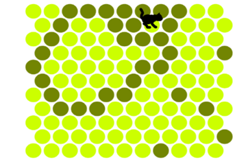

# Circle the cat

# Authors
Micha Briskman  
Shlomo gulayev  

# About
In this exercise we made a remake of the game Circle the cat.
This game is from the genre of puzzle games, in which the player is presented with a board with a "puzzle" that he must solve according to the rules of the game.
The player is shown a board of tiles - circles with "blocked tiles" - the dark circles and "empty tiles" - the circles
the bright ones There is a cat in the game, which can only walk on the empty circles. The stage starts with a number of circles already
full, with the cat standing in the center on an empty tile.
the Purpose of the game:
The player must surround the cat from all sides, with the help of "filling the tiles", so that he has nowhere to go:

# Game rules:
This is a turn-based game of player versus computer. The player on his turn chooses one tile he wishes to block by clicking
Mouse over the desired circle. The computer in its turn moves the cat to try to escape from obstacles, and in order to escape
from the board If the cat reached one side of the board, the cat actually escaped the board and won the game. If the player succeeded
surround the cat from all sides, as mentioned, the player won. Note: In order to win and pass a stage, it is not enough to block the
The cat in a certain space, because it can still "walk" within that space. The cat should be blocked completely.

# Implementation details:
1. We are required to realize a game that is pleasant to play, that everything goes smoothly, and that things do not "get stuck".
2. In our game there are three stages with a uniform size of 11x11 tiles in the indentation of each row
Second, when the board is different between the stages with an increasing difficulty level.
3. When the player completes a stage in victory the cat is blocked, we will present a message about the success and move on to the next stage.
4. When the player completes a stage with the cat running away failure, we will present a failure message and present the same stage again.
5. "Click counter": It is mandatory to display the number of clicks made so far.
6. Clicking on a full tile, or "just" clicking anywhere that is not an empty tile, does not affect the game, nor
It is counted in the number of clicks from the previous section.
7. Our reality in the game creates automatic stages. That is, the game creates the stages itself by drawing a lottery
the blocked tiles. The number of tiles blocked at the beginning of the stage will be between 14 easy stage tiles and 4
Hard phase tiles. Loading the stages should be done from easy to hard.

# Important points:
The board consists of a vector of Tile's unique_ptr. The board is similar to a matrix that has row and column only with indentation.
We created a struct called Location that holds 2 ints of a row and a column.
Each Tile holds a Location in the board, a variable of whether it is clicked, a variable of the circle shape and a vector of Location type neighbors.
The program calculates the shortest path using the BFS algorithm that we used. 
The program calculates all the paths to the edges of the board so that it takes into account the blocked tiles. Then it takes the nearest edges of the 
board and randomly chooses which edge the cat will go to. Each tile has someone "discovered" it ie the father (as in a normal BFS algorithm) 
and thus we can go "back" from the closest edge to the first tile from which the cat left and thus discover the next tile the cat will go to.

# Design
Controller contains the Board, contains the Cat, the InfoLine (which holds the undo button, number of clicks and the number of the step) and the window.
Board contains Tile
Macros – contains definitions of constants

# A list of the files we created and a short explanation:
Include Files
Board.h – the Board class holds vector<unique_ptr<Tiles>> - the board of a game and realizes the function of finding the next step of the cat
Cat.h – the Cat class holds a sprite and its location on the board
Controller.h – Controller class manages the game, contains Board, contains Cat and InfoLine and the window
InfoLine - the InfoLine class holds the number of clicks, the step number, and 2 stack<Location> that hold the player's actions and the cat's steps - their purpose is for the undo button
Macros.h – a file of constants such as the window size
Singleton.h – Singleton class loading files like images and fonts once
Tile.h – the Tile class holds a Location on the board, a variable of whether it is clicked, a variable of the shape of the circle and a neighbor vector of type Location.
Resources Files
Game_over.jpg – a picture of a message that the game is over
Level_up.jpg – a picture of a message that you have leveled up
Lost.jpg – a picture of a message that you lost the stage
Resized_cat.jpg – picture of the cat
Side of monster.ttf - font

SRC Files
Board.cpp – the implementation of the functions of the Board class
Cat.cpp – the implementation of the functions of the Cat class
Controller.cpp – the implementation of the functions of the Controller class
InfoLine.cpp – the implementation of the functions of the InfoLine class
Main.cpp – the main of the program
Singleton.cpp – the implementation of the Singleton functions
Tile.cpp – the implementation of Tile's functions
CmakeLists.txt – cmake for source files
